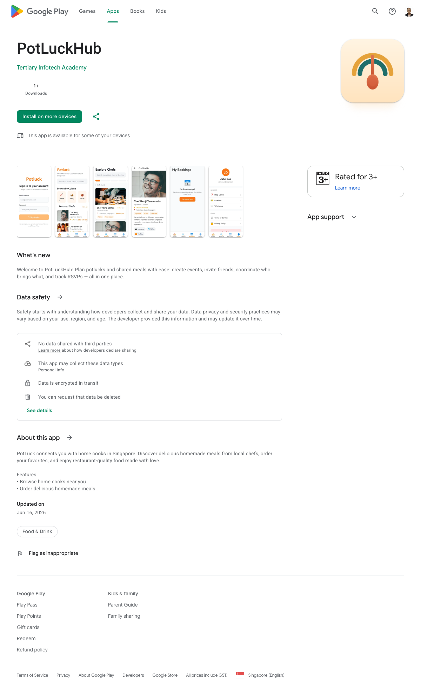

# Potluck — Native Android App 🌈🥄

[](https://kotlinlang.org)
[](https://developer.android.com/jetpack/compose)
[](https://m3.material.io/)
[](https://developer.android.com)
[](https://play.google.com/store/apps/details?id=io.potluckhub.app)

The official native **Kotlin + Jetpack Compose** Android app for [**Potluck — potluckhub.io**](https://potluckhub.io/) —
a Singapore marketplace connecting home chefs with food lovers. Discover talented local cooks,
browse their dishes, and book authentic home-cooked dining experiences.

### 📲 Download

**[Get it on Google Play →](https://play.google.com/store/apps/details?id=io.potluckhub.app)**

[](https://play.google.com/store/apps/details?id=io.potluckhub.app)

> Live on the Google Play Store — [play.google.com/store/apps/details?id=io.potluckhub.app](https://play.google.com/store/apps/details?id=io.potluckhub.app)

> Sister app to the [native iOS app](https://github.com/alfredang/potluckapp) and the
> [Potluck web platform](https://github.com/alfredang/potluck). Talks directly to the
> production Potluck API (`api.potluckhub.io`) — no mock data.

## Features

- **Explore home chefs** — featured carousel, full directory, search, and nine cuisine filters (Chinese, Western, Thai, Japanese, Korean, Malay, Indian, Halal, Vegetarian)
- **Browse dishes** — a photo-rich grid of menus across every chef, with prices and ratings
- **Verified & Featured chefs** — trust badges backed by Potluck's in-person site-visit verification ([how it works](https://potluckhub.io/chef-verification)), with featured chefs highlighted
- **Chef profiles** — bio, specialties, full menu, and live guest reviews
- **Write reviews & share** — rate a chef (1-5 stars), write a review, and share chefs & dishes via the Android share sheet
- **Booking & online payment** — pick date and guests, then pay in-app by credit/debit card (Stripe), PayPal, or PayNow (HitPay) through a secure hosted checkout (Chrome Custom Tabs) with live order-status polling
- **Accounts** — register / sign in against the live API, tokens persisted across launches
- **My bookings** — track requested and confirmed dining experiences

## Tech Stack

| Area | Choice |
|------|--------|
| Language | Kotlin 2.0 |
| UI | Jetpack Compose + Material 3, Navigation-Compose |
| Networking | OkHttp + kotlinx.serialization (typed envelope unwrap) |
| Images | Coil |
| Async | Kotlin Coroutines |
| Build | Gradle 8.11 (AGP 8.7), Android Gradle plugin |
| Backend | Potluck REST API — `https://api.potluckhub.io/api/v1` (catalog/auth) + `https://potluckhub.io/api` (checkout & reviews, shared with the website and iOS app) |

## Architecture

```
app/src/main/java/io/potluckhub/app/
├── MainActivity.kt   # NavHost + bottom navigation
├── Theme.kt          # Brand palette + Material 3 color scheme
├── Models.kt         # Serializable models (+ FlexDouble for string|number ratings)
├── Api.kt            # OkHttp client + Potluck endpoints, checkout & reviews (web origin)
├── Auth.kt           # AuthViewModel + token persistence
├── Components.kt     # Reusable composables (RemoteImage, RatingLabel, Pill…)
├── Screens.kt        # Explore, Chef detail, Dishes, Dish detail
└── Account.kt        # Bookings, Profile, Auth & Booking/checkout bottom sheets
```

Prices are stored as integer **cents**; ratings arrive as a String at chef level but a
number on menus — a `FlexDouble` serializer normalises both.

## Getting Started

Requires **JDK 17+** and the **Android SDK** (compileSdk 35).

```bash
# Build a debug APK
./gradlew :app:assembleDebug

# Install on a connected device
adb install -r app/build/outputs/apk/debug/app-debug.apk
```

The app points at the production API out of the box, so chefs and dishes load immediately.

## Release Build

```bash
# Signed Android App Bundle for Google Play (signing env in keystore/keystore.env — not committed)
set -a; source keystore/keystore.env; set +a
export POTLUCK_KEYSTORE="$PWD/keystore/potluck-release.jks"
./gradlew :app:bundleRelease   # -> app/build/outputs/bundle/release/app-release.aab

# Upload to Google Play (production) + submit for review
python3 scripts/play_upload.py
```

- **Application ID:** `io.potluckhub.app`
- **Version:** 1.3 (versionCode 130)

## License

MIT
